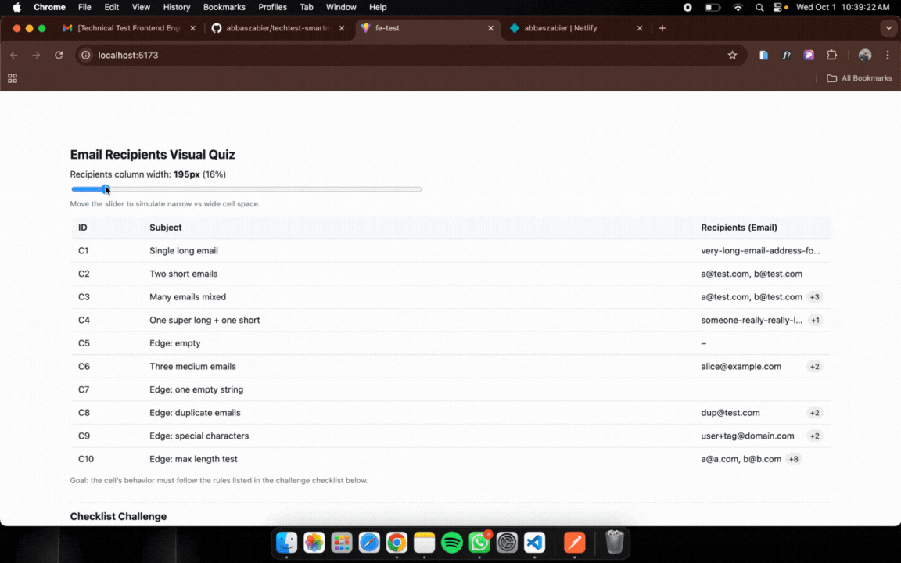

# Frontend Developer Quiz – Email Recipients Cell

This project is a solution for the **Email Recipients Cell Rendering Quiz**.  
The goal is to render a responsive email list inside a table cell, adapting to available width with different rendering rules.

## 🚀 How to Run Locally

### Prerequisites

- Node.js v20+
- npm or yarn package manager

### Steps

1. Clone the repository:

- git clone https://github.com/abbaszabier/techtest-smartm2m.git
- cd techtest-smartm2m

2. Install dependencies:

```bash
   npm install #npm install / yarn install
```

3. Start the development server:

```bash
   npm run dev or yarn dev
```

4. Open your browser and go to:

```bash
   http://localhost:5173 #default Vite dev server port
```

## 📝 Assumptions / Notes

- Tooltip for the badge uses the native title attribute for simplicity and accessibility.
- Email fitting is calculated dynamically using ResizeObserver and measured with a hidden span element.
- If only one email fits:
  - It is truncated with ellipsis if too long.
  - A +N badge appears if there are additional emails.
- If two or more emails fit:
  - All visible emails are shown in full.
  - A +N badge appears if there are hidden emails.
- Edge cases handled:
  - Empty list → renders –
  - Empty string email → renders as empty span
  - Duplicate emails are shown as-is
- CSS is minimal, no external UI libraries used.

## 📂 Relevant Structure

```bash
src/
 └─ components/
     └─ quiz/
         ├─ EmailCell.tsx   # final solution for the quiz
         ├─ EmailCellQuiz.tsx       # interactive harness (with slider)
         └─ quiz.css                # base styling
```

## Evaluation Checklist

- [✅] The cell renders emails based on available width.
- [✅] **Single + Badge Mode** works (truncate first email if too long).
- [✅] **Multi-Fit Mode** works (≥2 emails shown fully, no truncation).
- [✅] Badge shows remaining email count.
- [✅] Tooltip shows complete email list on hover.
- [✅] Separator between emails is `", "`.
- [✅] Responsive to column resizing (via slider in quiz).
- [✅] Handles empty email list gracefully.
- [✅] Basic accessibility is present (`aria-label` / `title`).
- [✅] Code is clean, structured, and type-safe.

## Demo

https://loquacious-muffin-7585b5.netlify.app/


